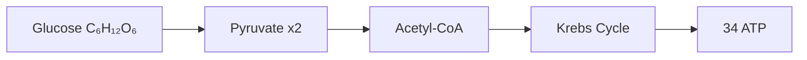
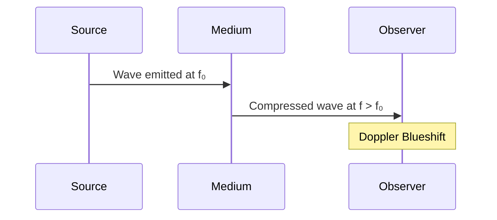
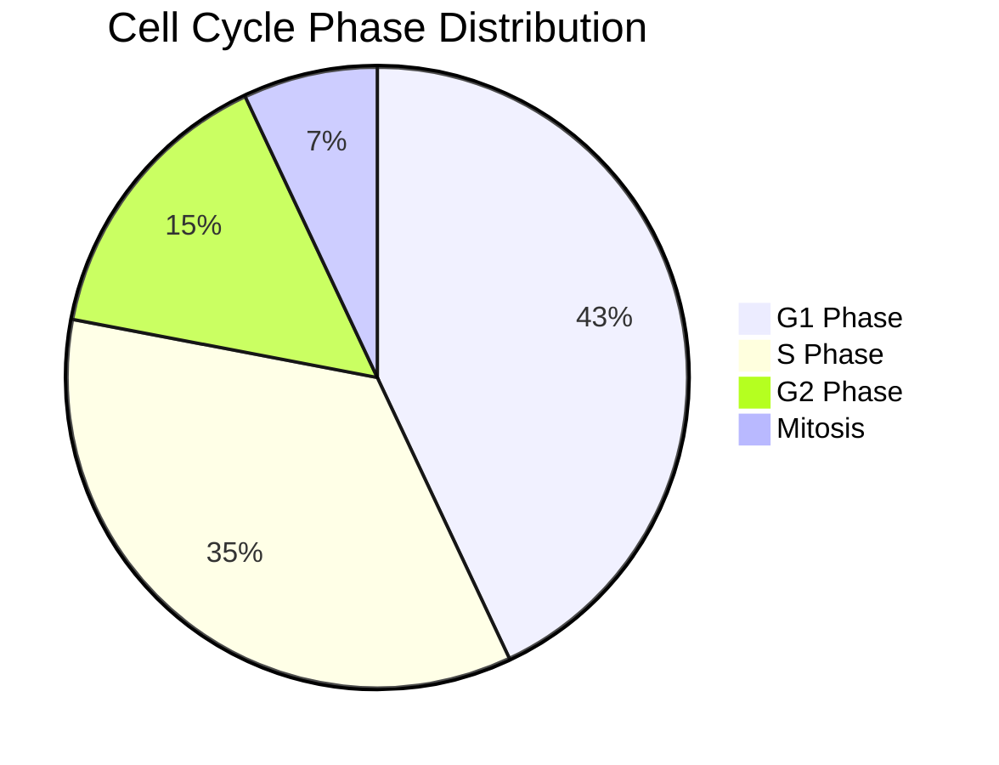
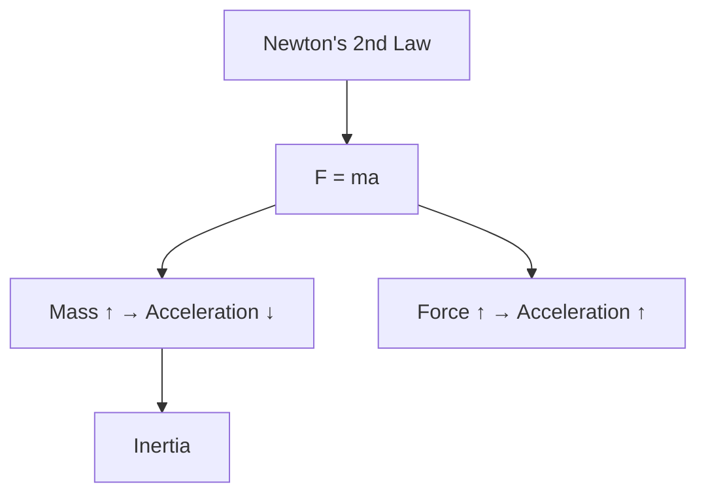

# Graph Schema for AI Card Generation

This document should be appended to the AI card-generation system prompt.
It defines the two fenced code block types that will be automatically rendered
as live visual components in the student review interface.

---

## Supported Graph Block Types

Cards support two special fenced block types inside `front` and `back` fields.
You MUST use them alongside regular markdown and KaTeX — they render as live visuals.

---

## 1. Diagrams — ` ```mermaid ` blocks

Use for: flowcharts, concept maps, sequences, pie charts, graph relationships.

**Supported diagram types:** `flowchart`, `graph`, `sequenceDiagram`, `pie`, `gitGraph`, `classDiagram`

### Flowchart Example (Chemistry)
````markdown

````

### Sequence Diagram Example (Physics)
````markdown

````

### Pie Chart Example (Biology)
````markdown

````

### Concept Map Example (General)
````markdown

````

**Rules:**
- Keep diagrams concise: max 8-10 nodes
- Use Unicode subscripts/superscripts in labels: `CO₂`, `H₂O`, `x²`
- Prefer `flowchart LR` for horizontal layouts, `flowchart TD` for vertical

---

## 2. Data Charts — ` ```chart ` blocks

Use for: numerical comparisons, trends over time, part-whole relationships.

### JSON Schema

```jsonc
{
  "type": "bar" | "line" | "pie",   // REQUIRED
  "title": "string",                // optional label shown above chart
  "xKey": "string",                 // REQUIRED for bar/line (x-axis field name)
  "yKey": "string",                 // REQUIRED for bar/line (y-axis field name)
  "color": "#HEX",                  // optional, default: amber for bar, green for line
  "data": [ ... ]                   // REQUIRED, array of objects
}
```

### Bar Chart Example (Chemistry — Ionisation Energies)
````markdown
```chart
{
  "type": "bar",
  "title": "First Ionisation Energy (kJ/mol)",
  "xKey": "element",
  "yKey": "energy",
  "color": "#F59E0B",
  "data": [
    { "element": "Li", "energy": 520 },
    { "element": "Na", "energy": 496 },
    { "element": "K",  "energy": 419 },
    { "element": "Rb", "energy": 403 }
  ]
}
```
````

### Line Chart Example (Physics — Velocity vs Time)
````markdown
```chart
{
  "type": "line",
  "title": "Free Fall: Velocity vs Time",
  "xKey": "t_s",
  "yKey": "v_ms",
  "color": "#10B981",
  "data": [
    { "t_s": 0, "v_ms": 0 },
    { "t_s": 1, "v_ms": 9.8 },
    { "t_s": 2, "v_ms": 19.6 },
    { "t_s": 3, "v_ms": 29.4 },
    { "t_s": 4, "v_ms": 39.2 }
  ]
}
```
````

### Pie Chart Example (Biology — Atmosphere)
````markdown
```chart
{
  "type": "pie",
  "title": "Atmospheric Composition",
  "data": [
    { "name": "N₂", "value": 78 },
    { "name": "O₂", "value": 21 },
    { "name": "Ar", "value": 1 }
  ]
}
```
````

**Rules:**
- `pie` type: use `name` and `value` keys only, no `xKey`/`yKey` needed
- `bar`/`line` type: `xKey` and `yKey` must exactly match keys in every data object
- Max data points: 12 for bar/line, 8 for pie
- `color` is optional — use to highlight a specific subject's accent colour

---

## Mixing Graphs with Markdown & KaTeX

Both block types work alongside regular markdown and KaTeX math in the same field.

### Combined Example (Flashcard back)
````markdown
The **work-energy theorem** states:

$$W_{net} = \Delta KE = \frac{1}{2}mv_f^2 - \frac{1}{2}mv_i^2$$

Velocity increases linearly under constant acceleration:

```chart
{
  "type": "line",
  "title": "v vs t (constant a = 9.8 m/s²)",
  "xKey": "t",
  "yKey": "v",
  "data": [
    {"t": 0, "v": 0}, {"t": 1, "v": 9.8},
    {"t": 2, "v": 19.6}, {"t": 3, "v": 29.4}
  ]
}
```

**Key insight:** The slope of this graph equals **g = 9.8 m/s²**.
````

---

## When to Use Each Type

| Situation | Use |
|-----------|-----|
| Show process/steps/flow | `mermaid flowchart` |
| Show relationships between concepts | `mermaid graph` |
| Show interactions/messages | `mermaid sequenceDiagram` |
| Show part-whole composition | `mermaid pie` OR `chart pie` |
| Compare numbers across categories | `chart bar` |
| Show change over time/variable | `chart line` |
| Plain text explanation | Regular markdown |
| Mathematical formula | KaTeX: `$formula$` or `$$formula$$` |
