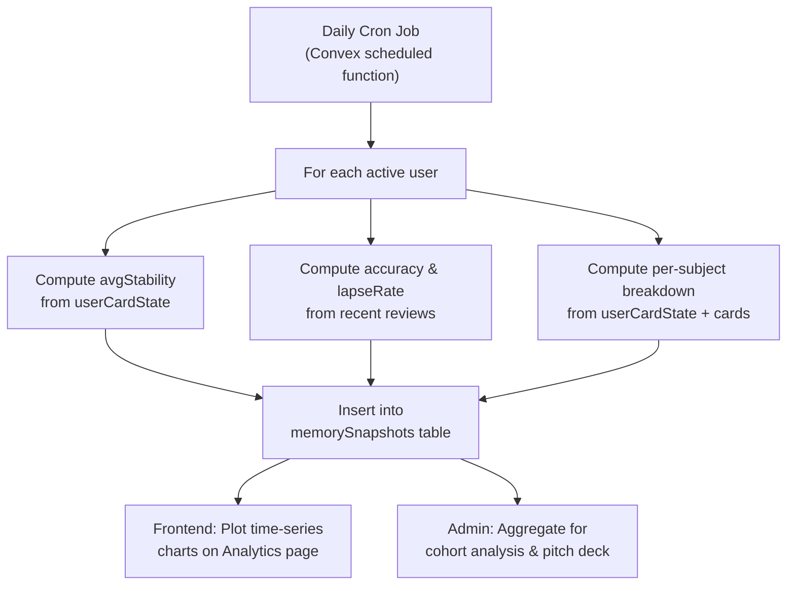

# 🧠 RecallIQ: Memory Profiling Strategy & Algorithm Improvements

> A strategic blueprint for building provable, investor-grade memory analytics and advancing the scheduling algorithm beyond commodity SRS.

---

## Table of Contents

1. [The Big Picture: Why This Matters](#the-big-picture)
2. [Part A: Memory Profiling & Analytics System](#part-a-memory-profiling--analytics-system)
   - [What You Have Now](#what-you-have-now)
   - [What You Need](#what-you-need)
   - [New Data Architecture](#new-data-architecture)
   - [The 7 Investor-Ready Metrics](#the-7-investor-ready-metrics)
   - [Time-Series Tracking Design](#time-series-tracking-design)
   - [Per-Subject Memory Fingerprinting](#per-subject-memory-fingerprinting)
   - [Cohort Analysis for Pitch Decks](#cohort-analysis-for-pitch-decks)
3. [Part B: Algorithm Improvements](#part-b-algorithm-improvements)
   - [Current Algorithm Analysis](#current-algorithm-analysis)
   - [15 Concrete Improvements](#15-concrete-improvements)
4. [Implementation Priority Matrix](#implementation-priority-matrix)

---

## The Big Picture

RecallIQ currently tracks reviews, but it doesn't yet **prove** that it makes students smarter over time. An investor wants to see one chart: *"Students who use RecallIQ for 90 days retain 3x more material than baseline."* To produce that chart, you need:

1. **Longitudinal memory data** — snapshots over time, not just current state
2. **Scientifically defensible metrics** — not "accuracy %" but "memory half-life in days"
3. **Per-subject granularity** — "This student's Chemistry memory grew 2.4x, but Physics only 1.1x"
4. **Cohort comparisons** — "Week-1 users vs Week-12 users show measurable memory growth"
5. **Algorithm edge** — improvements that go beyond stock FSRS and create a defensible moat

---

## Part A: Memory Profiling & Analytics System

### What You Have Now

| Data Point | Where It Lives | Granularity |
|---|---|---|
| Per-card stability & difficulty | `userCardState` | Per card × per user |
| Lapse count / rep count | `userCardState` | Per card × per user |
| Review rating, confidence, response time | `reviews` | Per review event |
| Retention multiplier | `userMemoryProfile` | Per subject (or global) |
| Recent accuracy (rolling) | `userMemoryProfile` | Single number |
| Daily review counts | Computed on-the-fly | 7-day window only |

> [!WARNING]
> **Critical Gap:** You have no historical snapshots. When the `retentionMultiplier` changes from 0.85 → 1.15 over 3 months, you have no record of *when* each change happened. You can't plot a growth curve. You can't prove anything to investors.

---

### What You Need

#### 1. `memorySnapshots` — The Time Machine Table

This is the single most important addition. A periodic snapshot of every user's memory state, taken automatically (daily or weekly).

```typescript
// NEW TABLE: convex/schema.ts
memorySnapshots: defineTable({
  userId: v.id("users"),
  snapshotDate: v.string(),           // ISO date "2026-07-15"
  
  // Global metrics
  globalRetentionMultiplier: v.number(),
  globalLearningSpeed: v.number(),
  globalAccuracy: v.number(),         // Rolling accuracy at snapshot time
  
  // Volume metrics
  totalCardsStudied: v.number(),      // Lifetime cards seen as of this date
  totalReviewsLifetime: v.number(),
  reviewsToday: v.number(),
  
  // Stability metrics (THE KEY INVESTOR METRIC)
  avgStability: v.number(),           // Average stability across all active cards (days)
  medianStability: v.number(),        // Median stability (less skewed by outliers)
  p90Stability: v.number(),           // 90th percentile stability
  
  // Memory health indicators
  matureCardCount: v.number(),        // Cards with stability > 21 days
  youngCardCount: v.number(),         // Cards with stability 1-21 days
  newCardCount: v.number(),           // Cards never reviewed
  lapseRate: v.number(),              // Lapses / total reviews in last 7 days
  
  // Per-subject breakdown (stored as JSON array)
  subjectBreakdown: v.optional(v.any()),
  // Shape: [{ subjectId, subjectName, avgStability, accuracy, cardCount, retentionMultiplier }]
  
  // Session metrics
  avgSessionDurationMs: v.optional(v.number()),
  avgResponseMs: v.number(),          // Getting faster = learning
  
  // Confidence calibration
  calibrationError: v.number(),       // |confidence - accuracy| (lower = better calibrated)
})
  .index("by_user_date", ["userId", "snapshotDate"])
  .index("by_user", ["userId"]),
```

> [!TIP]
> **Snapshot Strategy:** Run a daily Convex cron job that iterates over active users and computes these metrics from their current `userCardState` and recent `reviews`. This is cheap (one write per user per day) but creates an invaluable time-series.

---

#### 2. `reviewEvents` — Enhanced Review Logging

Your current `reviews` table is good but missing a few fields that unlock deeper analysis:

```typescript
// ADDITIONS to the existing reviews table
reviews: defineTable({
  // ... existing fields ...
  
  // NEW: Context at review time (for analysis)
  stabilityAtReview: v.optional(v.number()),   // What was the card's stability when reviewed?
  predictedRecall: v.optional(v.number()),     // What did FSRS predict? (0.0 - 1.0)
  elapsedDays: v.optional(v.number()),         // Days since last review
  
  // NEW: Session context
  positionInSession: v.optional(v.number()),   // 1st card, 5th card, etc. (fatigue analysis)
  timeOfDay: v.optional(v.number()),           // Hour of day (0-23) for circadian analysis
}),
```

These additional fields are **written at review time** (you already have the values computed in `recordReview`) and enable:
- Plotting the student's **actual forgetting curve** vs predicted
- Detecting **time-of-day effects** (e.g., "you retain 15% more when studying at 8am vs 11pm")
- Detecting **session fatigue** (accuracy drops after card 25 in a session)

---

### The 7 Investor-Ready Metrics

These are the numbers that go on slide 7 of your pitch deck.

#### Metric 1: 📈 Memory Half-Life Growth (MHL)

**What:** The average number of days a student can go before forgetting a card, tracked over time.

**Formula:** `Average stability across all mature cards`

**Why investors care:** This is the single most powerful metric. If a student's MHL goes from 5 days → 45 days over 3 months, you can literally say *"RecallIQ extended this student's memory by 9x."*

**How to compute:**
```
Week 1 MHL: avg(stability) of all cards with state="review" = 3.2 days
Week 4 MHL: 8.7 days
Week 8 MHL: 18.4 days  
Week 12 MHL: 42.1 days  ← THIS is the money chart
```

---

#### Metric 2: 🎯 Memory Efficiency Ratio (MER)

**What:** How many reviews does it take to move a card from "new" to "mature" (stability > 21 days)?

**Formula:** `avg(reps to reach stability > 21) / card count`

**Why investors care:** Lower = more efficient algorithm. Compare against SM-2 benchmarks (industry average: 8-12 reps). If RecallIQ does it in 5-6 reps, that's a competitive advantage.

---

#### Metric 3: 🔻 Forgetting Rate Decay (FRD)

**What:** The rate at which the student's lapse rate decreases over time.

**Formula:** `lapses_last_7_days / reviews_last_7_days`, plotted weekly

**Why investors care:** A declining forgetting rate proves the algorithm is working. A student who goes from 30% lapse rate → 5% lapse rate is demonstrably learning.

---

#### Metric 4: 🧬 Neural Retention Fingerprint (NRF)

**What:** A per-subject radar chart showing the student's memory strengths and weaknesses.

**Shape:**
```
Physics:     ████████░░ 82%
Chemistry:   ██████████ 95%
Mathematics: █████░░░░░ 50%
Biology:     ████████░░ 78%
```

**Why investors care:** Personalization proof. Shows the algorithm adapts differently per subject.

---

#### Metric 5: ⏱️ Learning Velocity (LV)

**What:** Cards mastered per hour of study time.

**Formula:** `cards_reaching_mature / total_study_hours`

**Why investors care:** Efficiency metric. "Students master 12 concepts per hour on RecallIQ vs 4 per hour with traditional flashcards."

---

#### Metric 6: 🎚️ Calibration Accuracy Index (CAI)

**What:** How well the student knows what they know. Gap between self-reported confidence and actual accuracy.

**Formula:** `1 - |avg_confidence_normalized - avg_accuracy|`

**Why investors care:** Metacognition improvement. A student whose CAI improves from 0.4 → 0.85 is developing better self-awareness — a skill transfer argument.

---

#### Metric 7: 🏔️ Knowledge Plateau Detection (KPD)

**What:** Automatically detect when a student's memory growth is stalling and needs intervention.

**Signal:** `MHL growth rate < 5% for 2+ consecutive weeks`

**Why investors care:** Shows the platform is intelligent enough to detect problems, not just schedule cards.

---

### Time-Series Tracking Design



**Implementation:** A Convex `crons.ts` job running once daily at 3 AM:

```typescript
// convex/crons.ts
import { cronJobs } from "convex/server";
import { internal } from "./_generated/api";

const crons = cronJobs();

crons.daily(
  "daily-memory-snapshots",
  { hourUTC: 21, minuteUTC: 30 }, // 3:00 AM IST
  internal.snapshots.computeDailySnapshots,
);

export default crons;
```

---

### Per-Subject Memory Fingerprinting

The `subjectBreakdown` field in each snapshot stores data like:

```json
[
  {
    "subjectId": "j57abc...",
    "subjectName": "Physics",
    "avgStability": 12.4,
    "accuracy": 0.78,
    "cardCount": 145,
    "retentionMultiplier": 0.92,
    "matureRatio": 0.45
  },
  {
    "subjectId": "k89def...",
    "subjectName": "Chemistry", 
    "avgStability": 28.7,
    "accuracy": 0.91,
    "cardCount": 203,
    "retentionMultiplier": 1.15,
    "matureRatio": 0.72
  }
]
```

This enables the **"memory radar chart"** on the student's analytics page, and the **"subject-level growth curve"** for investor decks.

---

### Cohort Analysis for Pitch Decks

With `memorySnapshots`, you can now run queries like:

| Query | Investor Slide |
|---|---|
| Avg MHL of users at Day 7 vs Day 90 | "Our users' memory grows 9x in 90 days" |
| MER comparison across subjects | "Math requires 40% more reps than Bio — our algorithm adapts" |
| Lapse rate Week 1 vs Week 12 | "Forgetting drops 85% after 12 weeks" |
| Users with MHL > 30 days | "X% of users reach deep retention within Y weeks" |
| Time-of-day accuracy heatmap | "Students retain 15% more in morning sessions" |

---

## Part B: Algorithm Improvements

### Current Algorithm Analysis

Your FSRS v5 implementation in [fsrs.ts](file:///r:/recalliq/recalliq/convex/fsrs.ts) is solid — it correctly implements the DSR model with 19 default W parameters, short-term/long-term stability splits, and lapse handling. Your `recordReview` in [reviews.ts](file:///r:/recalliq/recalliq/convex/reviews.ts) adds a Bayesian retention multiplier layer on top, which is a genuine differentiator.

**Current strengths:**
- ✅ Full FSRS v5 with correct stability/difficulty formulas
- ✅ Bayesian `retentionMultiplier` adapting per-user
- ✅ Subject-level memory profiles
- ✅ Support for personalized W arrays (`personalizedW`)
- ✅ Confidence pre-rating (metacognition signal)

**Current gaps:**

| Gap | Impact |
|---|---|
| Personalized W is never actually computed | The `personalizedW` field exists but is always `undefined` — every user uses the same global defaults |
| No time-of-day or circadian awareness | A card reviewed at 2 AM after 5 hours of studying is treated the same as 8 AM fresh |
| No session fatigue modeling | Card #1 and card #40 in a session are treated identically |
| No load balancing / fuzz | Reviews cluster on specific dates, creating "review mountains" |
| Same-day reviews aren't special-cased | If a student reviews a card, then sees it again 2 hours later (same day), FSRS treats it like a 0.08-day interval |
| No leech detection | Cards that are lapsed 5+ times are never flagged or handled differently |
| No interleaving intelligence | Mixed-subject sessions don't leverage the spacing effect between subjects |
| Difficulty inflation on "Again" | Repeated "Again" ratings can push difficulty to 10 quickly, making the card nearly impossible to graduate |

---

### 15 Concrete Improvements

---

#### 1. 🏋️ Personalized W Optimization (THE BIG ONE)

**What:** Compute a per-user set of 19 W parameters by running a mini optimizer on their review history.

**Why:** Stock FSRS defaults are trained on millions of Anki users. Your specific student population (Indian JEE/NEET prep, age 16-18, studying 3-6 hours/day) likely has different forgetting curves. Personalized W has been shown to reduce review load by an additional 10-15%.

**How:** After a user accumulates 400+ reviews, run a batch optimization (gradient descent or Bayesian optimization) on their `reviews` history to find the W values that best predict their actual recall outcomes. Store in `personalizedW`. Re-optimize monthly.

**Difficulty:** 🔴 High — requires implementing a lightweight optimizer function (can be a Convex action calling a Python/WASM module)

**Investor appeal:** 🌟🌟🌟🌟🌟 — *"Our algorithm literally trains a neural model on each student's brain."*

---

#### 2. ⏰ Time-of-Day Awareness (Circadian Scheduling)

**What:** Track when during the day a student reviews cards, and weight scheduling accordingly.

**Why:** Cognitive research shows recall is 10-20% better in morning vs late night. If a student consistently performs worse at 11 PM, the algorithm should schedule harder/newer cards for morning sessions.

**How:** 
- Log `timeOfDay` (hour) with each review
- Compute per-hour accuracy after 100+ reviews
- Create a `circadianMultiplier` in the memory profile (array of 24 floats)
- Apply as a modifier to stability when scheduling

**Difficulty:** 🟡 Medium

**Investor appeal:** 🌟🌟🌟🌟 — *"RecallIQ learns your chronotype and schedules harder material when your brain is sharpest."*

---

#### 3. 😮‍💨 Session Fatigue Modeling

**What:** Track the position of each card within a session and model accuracy decay.

**Why:** After 30+ cards in a single session, most students experience significant cognitive fatigue. Card #35 gets a lower-quality encoding than card #5.

**How:**
- Log `positionInSession` with each review
- Compute a fatigue curve: `fatigueMultiplier = 1.0 - (position / maxPosition) * fatigueFactor`
- Apply to the stability update — a card "learned" under fatigue gets a lower stability boost
- Surface this to the student: "Your accuracy drops 18% after card 25. Consider shorter sessions."

**Difficulty:** 🟢 Low-Medium

**Investor appeal:** 🌟🌟🌟 — *"We don't just schedule cards — we schedule your study sessions."*

---

#### 4. 📊 Fuzz Factor / Load Balancing

**What:** Add a ±10% random fuzz to scheduled intervals so reviews don't cluster on specific dates.

**Why:** Without fuzz, a batch of 50 cards imported on the same day will ALL come due on the same future date, creating "review mountains" that overwhelm the student.

**How:**
```typescript
const fuzz = 1.0 + (Math.random() * 0.2 - 0.1); // ±10%
const interval = Math.round(rawInterval * fuzz);
```

Also implement "Easy Days" — let students mark certain days as light-review days, and the scheduler spreads cards away from those days.

**Difficulty:** 🟢 Low

**Investor appeal:** 🌟🌟 — Quality of life, not a headline feature

---

#### 5. 🔄 Same-Day Review Handling

**What:** If a card is reviewed twice on the same day, treat the second review differently.

**Why:** Current code calculates `elapsedDays = (now - lastReview) / 86400000`, which could be 0.08 days (2 hours). FSRS's long-term stability formula breaks down at sub-day intervals, potentially producing nonsensical stability values.

**How:** If `elapsedDays < 1`, use the `shortTermStability` function instead of `longTermStability`, regardless of the card's state. This matches FSRS v5.1+ behavior.

**Difficulty:** 🟢 Low

**Investor appeal:** 🌟 — Bug fix, not a feature

---

#### 6. 🎯 Confidence-Weighted Scheduling

**What:** Use the pre-reveal confidence rating to modulate the scheduling impact.

**Why:** You already collect `confidence` before reveal — it's a free metacognition signal. A student who rates 5-star confidence but gets it wrong (overconfident) needs a harder penalty. A student who rates 1-star but gets it right (underconfident) needs an easier schedule to build their self-trust.

**How:**
```
If confidence=5 and wasCorrect=false → Apply 0.8x stability penalty (punish overconfidence)
If confidence=1 and wasCorrect=true  → Apply 1.2x stability bonus (reward hidden knowledge)
```

**Difficulty:** 🟡 Medium

**Investor appeal:** 🌟🌟🌟🌟 — *"RecallIQ teaches students to know what they don't know — metacognition training."*

---

#### 7. 🃏 Card Type Difficulty Modifiers

**What:** Different card types (MCQ, flashcard, cloze, numerical) have inherently different difficulty levels. Apply a per-type modifier.

**Why:** Getting an MCQ right is easier than free-recall (flashcard) because MCQs provide recognition cues. A "Good" on an MCQ should boost stability less than a "Good" on a free-recall card.

**How:**
```typescript
const TYPE_DIFFICULTY_MODIFIER: Record<string, number> = {
  flashcard: 1.0,          // Baseline — pure free recall
  elaborative: 1.0,        // Also free recall
  cloze: 0.95,             // Slightly easier (context cues)
  mcq: 0.85,               // Recognition memory, not recall
  numerical: 1.1,          // Harder — exact value needed
  assertion_reason: 1.05,  // Harder — requires logical reasoning
  error_spotting: 1.1,     // Harder — requires deep analysis
  matrix_match: 1.15,      // Hardest — multi-dimensional matching
  sequencing: 1.05,        // Moderate — ordering
  multi_select: 0.9,       // Similar to MCQ but harder (no single answer)
  true_false_justify: 0.95 // Easy recognition but justification adds difficulty
};
```

Apply this modifier to the stability calculation so that MCQ-correct doesn't inflate stability as much as flashcard-correct.

**Difficulty:** 🟢 Low

**Investor appeal:** 🌟🌟🌟 — *"RecallIQ knows that recognizing an answer isn't the same as recalling it."*

---

#### 8. 🩹 Leech Detection & Intervention

**What:** Automatically flag cards that a student has lapsed 5+ times and suggest intervention.

**Why:** "Leeches" are cards that waste review time — the student keeps forgetting them because the card itself is poorly worded, the concept needs prerequisite knowledge, or the student has a fundamental misunderstanding.

**How:**
- If `lapses >= 5`, mark the card as a "leech" in the UI
- Suggest: "This card keeps tripping you up. Try rephrasing it, adding a mental hook, or studying the prerequisite concept first."
- Optionally auto-suspend leeches after 8 lapses and surface them in a "Leech Hospital" view

**Difficulty:** 🟢 Low

**Investor appeal:** 🌟🌟 — Quality of life improvement

---

#### 9. 🔀 Interleaving Intelligence

**What:** When a student reviews a mixed-subject session, actively interleave cards from different subjects rather than grouping by topic.

**Why:** The "interleaving effect" (Rohrer & Taylor, 2007) shows that mixing problem types during practice improves long-term retention by 43-76% compared to blocked practice. Your `sessions` table already has `mode: "interleaved"` but the card ordering is random, not strategically interleaved.

**How:**
- Sort the card queue so that no two consecutive cards are from the same subject
- Bonus: space cards from the same subtopic at least 3 positions apart
- Use a round-robin shuffle algorithm across subjects

**Difficulty:** 🟢 Low

**Investor appeal:** 🌟🌟🌟 — *"Our interleaving engine is backed by peer-reviewed cognitive science."*

---

#### 10. 🧊 Difficulty Inflation Fix

**What:** Prevent the difficulty value from getting stuck at 10 after repeated lapses.

**Why:** The current `nextDifficulty` function uses mean reversion (`W[7] * (W[4] - raw)`), but with repeated "Again" ratings, difficulty still trends toward 10. Once at 10, the card becomes extremely hard to escape because the stability multiplier is heavily penalized by `(11 - d)`.

**How:** Cap the maximum practical difficulty at 8.5 instead of 10, and increase the mean reversion weight for high-difficulty cards:
```typescript
const meanReversionWeight = d > 7 ? W[7] * 1.5 : W[7]; // Stronger pull-back at high difficulty
return clamp(raw + meanReversionWeight * (W[4] - raw), 1, 8.5);
```

**Difficulty:** 🟢 Low

**Investor appeal:** 🌟🌟 — Bug fix that prevents frustrating user experience

---

#### 11. 📉 Retrievability-Based Queue Sorting

**What:** Sort the due card queue by retrievability (lowest first) instead of by due date.

**Why:** A card that's 10% likely to be recalled is more urgent than one that's 70% likely, even if both are "due." Reviewing the 10% card first maximizes the memory-strengthening effect.

**How:**
```typescript
// In getDueCards, after fetching due cards:
cards.sort((a, b) => {
  const rA = retrievability(elapsedDays(a), a.stability);
  const rB = retrievability(elapsedDays(b), b.stability);
  return rA - rB; // Lowest retrievability first
});
```

**Difficulty:** 🟢 Low

**Investor appeal:** 🌟🌟🌟 — *"Every session starts with the material you're most at risk of forgetting."*

---

#### 12. 🌡️ Response Time as Signal

**What:** Use `responseMs` (time to answer) as an additional signal for memory strength.

**Why:** A correct answer in 2 seconds indicates stronger memory than a correct answer in 45 seconds. The fast responder has more automatic, consolidated knowledge.

**How:**
- Compute `responseSpeed = median_responseMs / responseMs` (>1 = faster than usual)
- Apply a small modifier to stability: fast-correct gets +5% stability boost, slow-correct gets -5%
- Careful: don't penalize slow responses for complex card types (numerical, matrix_match)

**Difficulty:** 🟡 Medium

**Investor appeal:** 🌟🌟🌟 — *"RecallIQ detects hesitation. If you pause before answering, we know you're less certain — even if you got it right."*

---

#### 13. 📊 Predictive Retention Curve Visualization

**What:** Show each student a visual "forgetting curve" for their strongest and weakest subjects, updated in real-time.

**Why:** The Ebbinghaus forgetting curve is one of the most powerful visualizations in education. Showing a student their *personal* forgetting curve (not a textbook one) is deeply motivating.

**How:**
- For each subject, take all reviews and compute `retrievability` at t=1, 3, 7, 14, 30, 60, 90 days
- Plot the curve using Recharts
- Overlay the "with RecallIQ" curve (using their actual stability) vs "without" (stock Ebbinghaus decay)
- This is a frontend feature, not an algorithm change

**Difficulty:** 🟡 Medium

**Investor appeal:** 🌟🌟🌟🌟🌟 — *THE investor demo. "This is YOUR brain on RecallIQ vs without it."*

---

#### 14. 🧮 FSRS v6 Upgrade Path

**What:** Upgrade from FSRS v5 (19 parameters) to FSRS v6 (17 parameters with refined short-term handling).

**Why:** FSRS v6 is now the standard in Anki (2026). It handles same-day reviews and initial learning phases better, and has slightly better predictive accuracy in benchmarks.

**How:** Update the W defaults, modify the `shortTermStability` and initial learning step logic. The core DSR model is the same — this is a parameter update, not a rewrite.

**Difficulty:** 🟡 Medium

**Investor appeal:** 🌟🌟 — Technical correctness, not a headline feature

---

#### 15. 🧪 A/B Testing Infrastructure

**What:** Build the ability to run A/B tests on scheduling parameters.

**Why:** The ultimate investor pitch: *"We don't just claim our algorithm is better — we run controlled experiments on our own users to prove it."* You can test any improvement (confidence-weighting, interleaving, time-of-day) as an A/B experiment.

**How:**
- Add `experimentGroup: v.optional(v.string())` to the `users` table
- Randomly assign new users to "control" (default W) or "treatment" (modified W)
- After N weeks, compare MHL, MER, and lapse rates between groups
- This infrastructure makes every future improvement measurable

**Difficulty:** 🟡 Medium

**Investor appeal:** 🌟🌟🌟🌟🌟 — *"We run experiments. We have data. We don't guess."*

---

## Implementation Priority Matrix

| Priority | Improvement | Effort | Investor Impact | User Impact |
|---|---|---|---|---|
| 🔴 P0 | `memorySnapshots` table + cron | Medium | 🌟🌟🌟🌟🌟 | Low (invisible to user) |
| 🔴 P0 | Enhanced review logging (predictedRecall, elapsedDays) | Low | 🌟🌟🌟🌟 | Low (invisible) |
| 🔴 P0 | Predictive Retention Curve Visualization (#13) | Medium | 🌟🌟🌟🌟🌟 | 🌟🌟🌟🌟🌟 |
| 🟠 P1 | Fuzz Factor / Load Balancing (#4) | Low | 🌟🌟 | 🌟🌟🌟🌟 |
| 🟠 P1 | Same-Day Review Fix (#5) | Low | 🌟 | 🌟🌟🌟 |
| 🟠 P1 | Difficulty Inflation Fix (#10) | Low | 🌟🌟 | 🌟🌟🌟🌟 |
| 🟠 P1 | Retrievability-Based Queue Sort (#11) | Low | 🌟🌟🌟 | 🌟🌟🌟 |
| 🟠 P1 | Leech Detection (#8) | Low | 🌟🌟 | 🌟🌟🌟🌟 |
| 🟡 P2 | Card Type Difficulty Modifiers (#7) | Low | 🌟🌟🌟 | 🌟🌟🌟 |
| 🟡 P2 | Interleaving Intelligence (#9) | Low | 🌟🌟🌟 | 🌟🌟🌟 |
| 🟡 P2 | Confidence-Weighted Scheduling (#6) | Medium | 🌟🌟🌟🌟 | 🌟🌟🌟 |
| 🟡 P2 | Session Fatigue Modeling (#3) | Medium | 🌟🌟🌟 | 🌟🌟🌟 |
| 🟡 P2 | Response Time as Signal (#12) | Medium | 🌟🌟🌟 | 🌟🌟 |
| 🟢 P3 | Time-of-Day Awareness (#2) | Medium | 🌟🌟🌟🌟 | 🌟🌟🌟 |
| 🟢 P3 | Personalized W Optimization (#1) | High | 🌟🌟🌟🌟🌟 | 🌟🌟🌟🌟 |
| 🟢 P3 | A/B Testing Infrastructure (#15) | Medium | 🌟🌟🌟🌟🌟 | 🌟 |
| 🟢 P3 | FSRS v6 Upgrade (#14) | Medium | 🌟🌟 | 🌟🌟 |

---

> [!IMPORTANT]
> **The single most important thing you can build right now** is the `memorySnapshots` cron job. Without it, every day of student usage is wasted data. Every review a student does today is a data point that could prove memory growth — but only if you're snapshotting the state. Start this before anything else.

---

> [!TIP]
> **The killer investor demo** is Improvement #13 (Predictive Retention Curve). Imagine showing an investor two curves side by side: *"This is Rahul's forgetting curve in Week 1. This is his forgetting curve in Week 12. His memory half-life grew from 3 days to 45 days. That's RecallIQ."* That's the slide that gets you the cheque.
